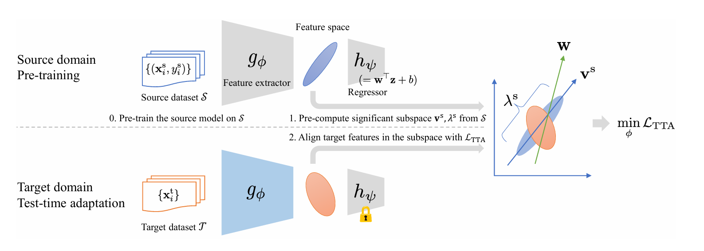

# Test-time Adaptation for Regression by Subspace Alignment (ICLR 2025)
The official implementation for ICLR 2025 paper "Test-time Adaptation for Regression by Subspace Alignment."  
[[OpenReview](https://openreview.net/forum?id=SXtl7NRyE5)] [[arXiv](https://arxiv.org/abs/2410.03263)] [[Poster](https://github.com/kzkadc/kzkadc.github.io/blob/main/assets/publications/ICLR2025_poster.pdf)]

<details><summary><strong>Abstract</strong></summary>
This paper investigates <em>test-time adaptation (TTA) for regression</em>, where a regression model pre-trained in a source domain is adapted to an unknown target distribution with unlabeled target data. Although regression is one of the fundamental tasks in machine learning, most of the existing TTA methods have classification-specific designs, which assume that models output class-categorical predictions, whereas regression models typically output only single scalar values. To enable TTA for regression, we adopt a feature alignment approach, which aligns the feature distributions between the source and target domains to mitigate the domain gap. However, we found that naive feature alignment employed in existing TTA methods for classification is ineffective or even worse for regression because the features are distributed in a small subspace and many of the raw feature dimensions have little significance to the output. For an effective feature alignment in TTA for regression, we propose <em>Significant-subspace Alignment (SSA)</em>. SSA consists of two components: subspace detection and dimension weighting. Subspace detection finds the feature subspace that is representative and significant to the output. Then, the feature alignment is performed in the subspace during TTA. Meanwhile, dimension weighting raises the importance of the dimensions of the feature subspace that have greater significance to the output. We experimentally show that SSA outperforms various baselines on real-world datasets.
</details>



## 0. Environment
- Prepare the datasets (SVHN, MNIST, UTKFace, Biwi Kinect, California Housing) and write their path in `dataset/dataset_config.py`.
- Install dependencies or build the docker image according to `docker/Dockerfile`.

```bash
$ docker build -t tta_regression docker --no-cache
```


## 1. Training the source model
```bash
$ python3 train_source.py -c configs/train_source/svhn.yaml -o result/source/svhn

# running with the docker image
$ docker run -it --rm -v $(pwd):$(pwd) -w $(pwd) --gpus device=0 tta_regression python3 train_source.py -c configs/train_source/svhn.yaml -o result/source/svhn
```


## 2. Computing the feature statistics
```bash
$ python3 feature_stats.py -c configs/feature_stats/svhn.yaml -o result/source/svhn
```

The pre-trained model and feature statistics for SVHN are available in `result/`.


## 3. TTA
```bash
$ python3 adaptation.py -c configs/tta/svhn.yaml -o result/tta/svhn
```


## Citation
If our work assists your research, please cite our paper:

```
@inproceedings{adachi2025testtime,
title={Test-time Adaptation for Regression by Subspace Alignment},
author={Kazuki Adachi and Shin'ya Yamaguchi and Atsutoshi Kumagai and Tomoki Hamagami},
booktitle={The Thirteenth International Conference on Learning Representations},
year={2025},
url={https://openreview.net/forum?id=SXtl7NRyE5}
}
```
